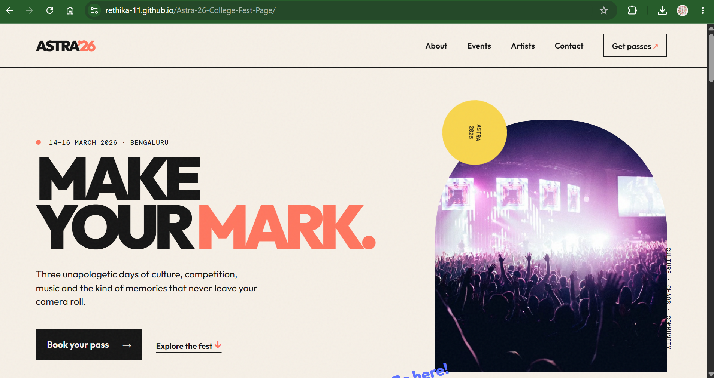
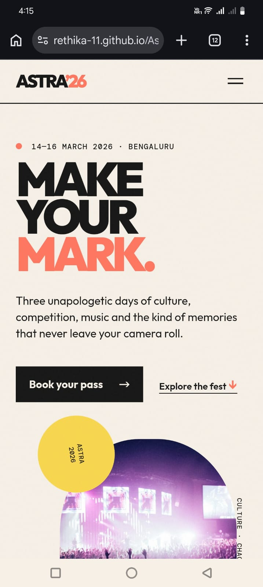

<h1 align="center">🎪 ASTRA ’26</h1>

<b>Three unapologetic days of culture, competition, music and memories.</b>

🔗 <a href="#">LIVE SITE — //rethika-11.github.io/Astra-26-College-Fest-Page/ </a> · 📅 14–16 March 2026 · 📍 Bengaluru

---
##Live Link
https://rethika-11.github.io/Astra-26-College-Fest-Page/
Repo: https://github.com/rethika-11/Astra-26-College-Fest-Page

## 🎟 On the page

- **Hero** — ASTRA ’26 branding, festival dates and pass CTA
- **Live countdown timer** ⏳ — ready to add before publishing
- **Events grid** — music, dance, design and culture events
- **Day-wise schedule**
- **Sponsors marquee** — infinite scrolling highlight strip
- **Register Now** + contact footer

## 🗓 Schedule preview

| Day | Highlights |
|-----|-----------|
| Day 1 | Opening ceremony · Battle of the Bands · Open Mic Stories |
| Day 2 | Rhythm Riot · Canvas Clash · Creator workshops |
| Day 3 | Headliner night · Awards · ASTRA afterparty |

## 📸 Screenshots

### Home Page

### Product Page

## 🛠 Stack & credits

HTML5 · CSS3 · JavaScript · Responsive CSS Grid & Flexbox · Scroll reveal, marquee and 0.8s transitions · Pexels event imagery · Google Fonts · GitHub Pages

## 🤖 AI usage · 📚 What I learned

AI was used to help structure the landing page, write responsive CSS, and create small interactive features. I learned how to build a clear event hierarchy, combine CSS Grid with Flexbox, make layouts work on phones, and use transitions and intersection-based reveal animations without a framework.

---

## 🎓 About TAP Academy

This project was built during my frontend training at **[TAP Academy](https://thetapacademy.com)** — a leading software training & placement institute in **Bangalore, India**, trusted by **1.5+ lakh students**.

**Why students choose TAP Academy:**

- 🚀 **Get placed in 60 days** — dedicated placement track with daily placement drives
- 🥽 **Augmented Reality (AR) classrooms** — concepts you can see, not just read
- 🎤 **Weekly mock interviews** with real-time feedback
- 👨‍🏫 **1-on-1 mentorship** and round-the-clock doubt support
- 💻 Courses in **Java, Python, Full Stack Development, Data Science & AI**

### ❓ FAQ

**What is TAP Academy?**
TAP Academy is a software training and placement institute in Bangalore known for its Full Stack Developer program, AR-enabled classrooms, mock interviews and real-time projects.

**Does TAP Academy provide placement support?**
Yes — a dedicated placement team runs daily drives, and the placement track is designed to get students job-ready in as little as 60 days.

**Where can I learn more?**
🔗 [Website](https://thetapacademy.com) · [Placements](https://thetapacademy.com/placements) · [LinkedIn](https://in.linkedin.com/company/thetapacademy) · [YouTube](https://www.youtube.com/tapacademy)

---
*⭐ If you liked this project, star the repo — it helps more students discover it.*
